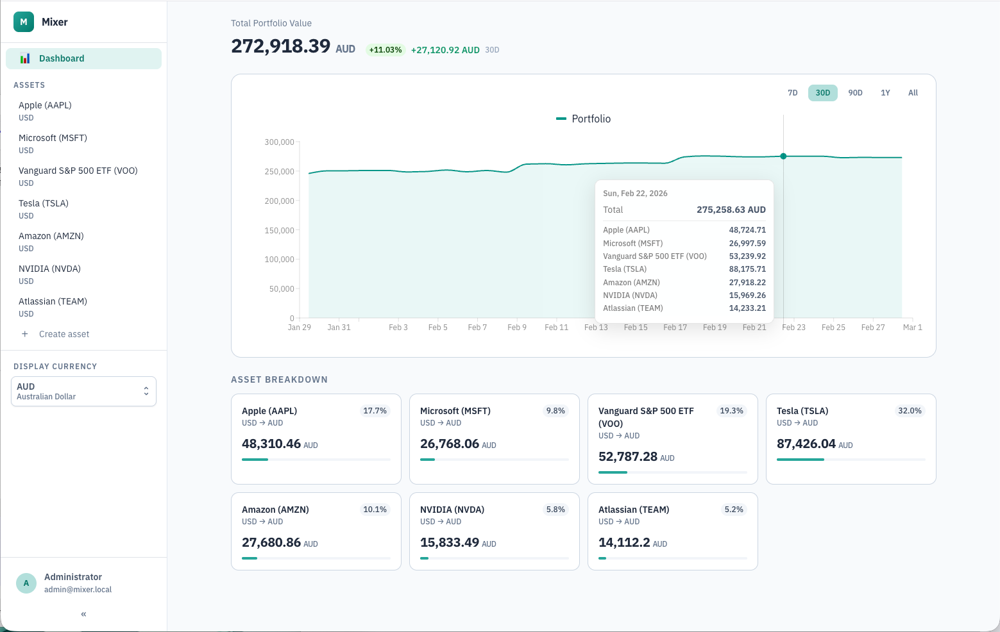
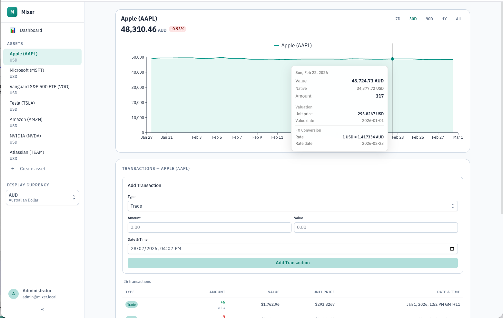

# Mixer

A self-hosted portfolio tracking application for managing financial assets, transactions, and aggregated valuations with multi-currency support.

## Features

- **Portfolio tracking** — Track assets across multiple currencies with daily aggregation
- **Multi-currency support** — Automatic FX conversion between configurable currency pairs (EUR, GBP, AUD, NZD, USD, HKD by default)
- **Interactive charts** — Portfolio and per-asset charts with date range selectors, tooltips, and live recalculation indicators
- **Background processing** — Async aggregation and FX backfill via JobRunr
- **Timezone-aware** — All aggregation respects the user's configured IANA timezone
- **Market data** — Automatic price fetching for market-traded assets via Yahoo Finance
- **Seed data** — Optional realistic demo portfolio loaded from CSV files

## Screenshots




## Quick Start

### Prerequisites

- Java 21+
- Node.js 20+ and Yarn
- An [Oanda API](https://developer.oanda.com/) token for FX rates (optional — app runs without it, but FX conversion won't work)

### Local Development Setup

1. **Copy the local config template:**
   ```bash
   cp src/main/resources/application-local.properties.example \
      src/main/resources/application-local.properties
   ```

2. **Edit `application-local.properties`** and set your Oanda API token (or leave it to run without FX).

3. **Start the backend:**
   ```bash
   ./gradlew bootRun
   ```

4. **Start the frontend** (separate terminal):
   ```bash
   cd frontend && yarn install && yarn dev
   ```

The backend runs on port 8080, the frontend dev server on port 5173 (proxies API calls to 8080).

The default seed data creates an admin user (`admin@mixer.local` / `admin123`) with a demo portfolio.

### Configuration

Configuration is split across two files:

- **`application.properties`** — Committed defaults, safe for public repos
- **`application-local.properties`** — Local/secret overrides, gitignored (copy from `.example`)

For production, configure via environment variables:

| Property | Default | Description |
|----------|---------|-------------|
| `mixer.currency.provider` | `""` | FX provider (set to `oanda` to enable) |
| `mixer.currency.token` | `""` | Oanda API token |
| `mixer.fx.currencies` | `EUR,GBP,AUD,NZD,USD,HKD` | Supported currency codes |
| `mixer.refresh.aggregations.interval` | `300000` | Aggregation refresh interval (ms) |
| `mixer.refresh.aggregations.initial` | `10000` | Initial delay before first aggregation refresh (ms) |
| `mixer.refresh.fx.interval` | `300000` | FX backfill interval (ms) |
| `mixer.refresh.fx.initial` | `10000` | Initial delay before first FX backfill (ms) |
| `mixer.data.seed.insert` | `true` | Insert demo seed data on startup |
| `spring.datasource.url` | *(must be set)* | Database JDBC URL |

### Docker

Two images are published to GHCR on every push to `main`:

| Image | Port | Description |
|-------|------|-------------|
| `ghcr.io/jacksonrakena/mixer` | 8080 | Backend API (Spring Boot) |
| `ghcr.io/jacksonrakena/mixer-frontend` | 3000 | Frontend (static file server) |

```bash
# Backend
docker run -p 8080:8080 \
  -e SPRING_DATASOURCE_URL=jdbc:h2:file:./data/mixer \
  -e MIXER_CURRENCY_PROVIDER=oanda \
  -e MIXER_CURRENCY_TOKEN=your-token \
  -v mixer-data:/application/data \
  ghcr.io/jacksonrakena/mixer:latest

# Frontend
docker run -p 3000:3000 \
  ghcr.io/jacksonrakena/mixer-frontend:latest
```

Route `/api/*` from the frontend to the backend using your deployment infrastructure (reverse proxy, ingress, etc.).

## Build & Test

```bash
./gradlew compileKotlin          # Compile backend
./gradlew test                   # Run all tests
cd frontend && npx tsc --noEmit  # Type check frontend
```

## Tech Stack

- **Backend**: Kotlin + Spring Boot 4 + Exposed ORM + JobRunr
- **Frontend**: React 19 + TypeScript + MUI Joy UI + Vite + MUI X Charts
- **Database**: H2 (development) / PostgreSQL (production)
- **Sessions**: Spring Session JDBC

## License

&copy; 2024&mdash;2026 Jackson Rakena, MIT License